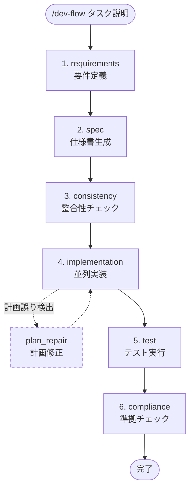
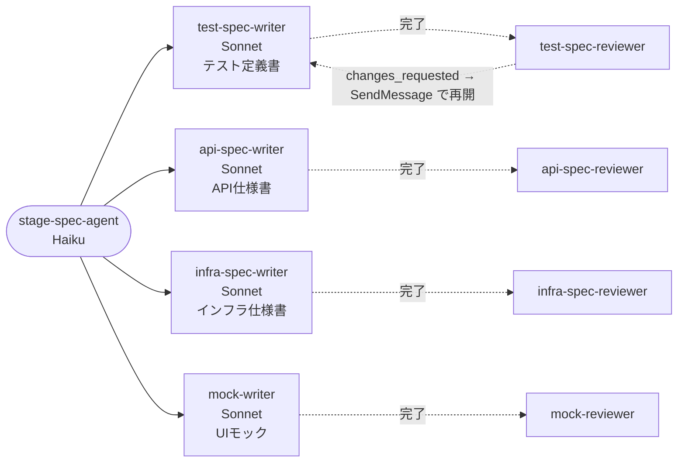
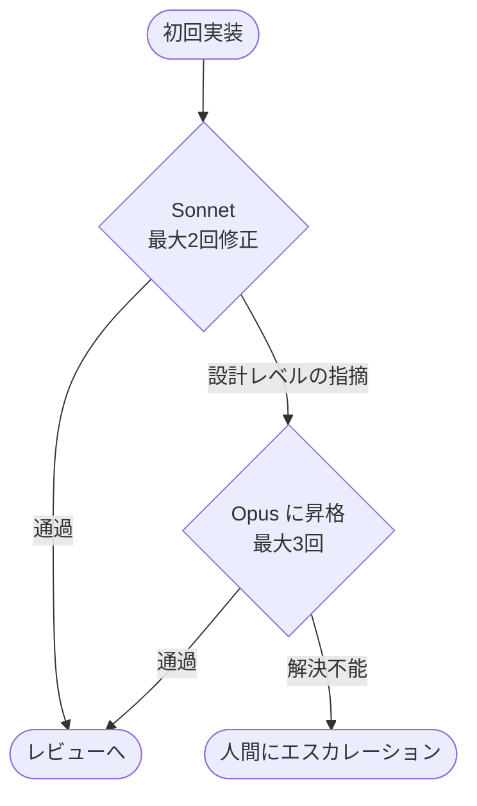
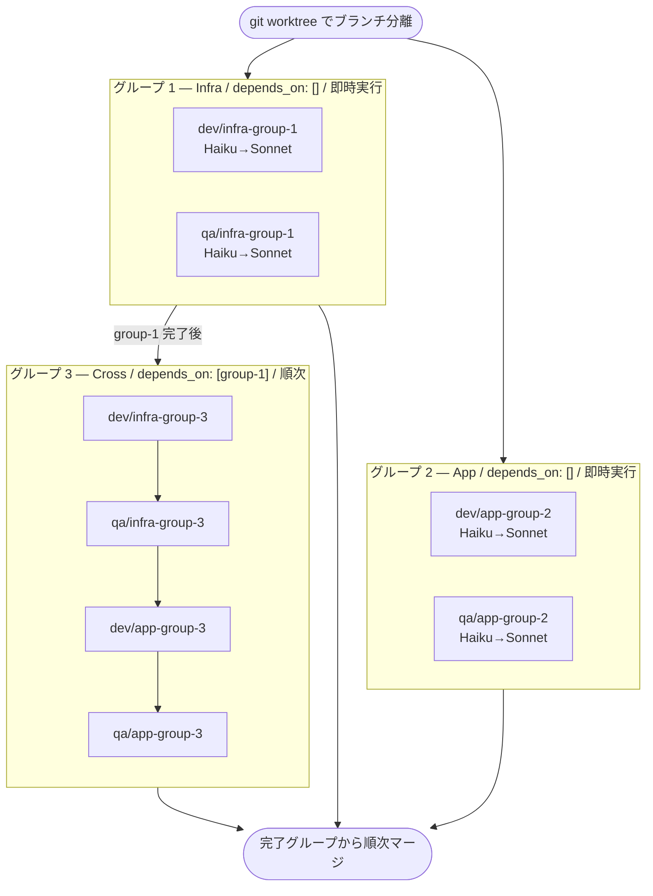

# dev-flow スキル集

Claude Code 用の AI 駆動開発フロースキルです。要件定義 → ドキュメント生成 → 整合性チェック → 並列実装 → テスト → 準拠チェック までを一貫したフローとして自動化し、ドキュメントを「唯一の正解」として扱うことで「何を作るか」の認識齟齬を実装前に解消します。

---

## クイックスタート

```bash
git clone git@github.com:youmjww/dev-flow-skills.git ~/dev-flow-skills
bash ~/dev-flow-skills/setup.sh
```

`~/.claude/skills/` に各スキルへのシンボリックリンクが作成され、`~/.claude/settings.json` に dev-flow の hooks が登録されます（登録前に `settings.json.bak.*` としてバックアップを取ります。hooks が不要なら `setup.sh --no-hooks`）。あとは Claude Code で次のように起動します。

```
/dev-flow 新機能を実装したい
```

各ステージが完了したら `/dev-flow` を再実行するだけで次ステージへ進みます。状態は `doc/process/state.json` に保存されるため、セッションをまたいでも継続できます。

---

## 全体フロー



> 破線の `plan_repair` は implementation 中に計画誤りが見つかったときだけ通る内部サイクルです。incremental モードでは consistency の先頭で Impact Analysis（STEP 0）を実行します。

ステージ名は `--from=` の値・`state.json.next_stage`・エージェント名（`stage-<stage>-agent`）・`task_checklist.md` の進捗行で共通です。

| Stage | スキル | 役割 | モデル |
|---|---|---|---|
| 1. requirements | `/dev-flow-requirements` | 対話で要件深掘り・曖昧表現リント・用語集整備・REQ-NNN 付与 | Opus 4.7 |
| 2. spec | `/dev-flow-spec` | テスト/API/インフラ/モックを並列生成（OpenAPI 3.1.0 / Gherkin） | Haiku（子: Sonnet） |
| 3. consistency | `/dev-flow-consistency` | Impact Analysis（incremental のみ）・ID整合性・カバレッジ行列・DAG分類・設計凍結 | Haiku（子: Opus / Sonnet） |
| 4. implementation | `/dev-flow-implementation` | DAG依存解決・並列実装・推論トレース・Plan Repair | Sonnet → Opus |
| 5. test | `/dev-flow-test` | 自動モデル昇格でテスト全通過 | Haiku → Sonnet |
| 6. compliance | `/dev-flow-compliance` | カバレッジ行列で機械検証・完了報告 | Opus 4.7 |

---

## 使い方

### 基本コマンド

```
/dev-flow 新機能を実装したい                       # kind=feature（既定）
/dev-flow --kind=change "ログインの有効期限を 30 日に"   # 既存機能の要件変更
/dev-flow --kind=fix "退会後もログインできてしまう"      # 不具合修正（要件は変えない）
/dev-flow --kind=refactor "認証ミドルウェアを分割"       # 挙動を変えない内部改善
```

### 変更種別（kind）と通るステージ

| kind | requirements | spec | consistency | implementation | test | compliance |
|---|---|---|---|---|---|---|
| `feature` | ● | ● 全文生成 | ● | ● | ● | ● 全 ID |
| `change` | ● 修正モード | ● 差分更新（既存 ID 保持） | ● Impact Analysis | ● 影響グループ | ● | ● 変更 ID |
| `fix` | — | ● 再現 TC 追加 | ● lite | ● 1 グループ | ● | ● 追加 TC |
| `refactor` | — | — | ● lite | ● 1 グループ | ● | ● 全 ID（挙動不変） |

`--kind` を省略すると、実装コードがあるプロジェクトでは起動時に選択肢が出ます。

### 既存プロジェクトへの導入（bootstrap）

dev-flow は REQ / TC / API の ID が振られたドキュメントを差分の基点にします。ドキュメントの無い既存コードには、最初に 1 回だけ `bootstrap` を実行して as-is ドキュメントを逆生成します：

```
/dev-flow --bootstrap                 # リポジトリ全体
/dev-flow --bootstrap "認証まわりだけ"  # 範囲のヒント（300 ファイル超なら対象ディレクトリを聞かれる）
```

生成物: コード棚卸し（`doc/process/inventory.md`）、as-is 要件定義書（`doc/requirements/as-is-*.md`、根拠と confidence 付き）、既存テストを対応付けたテスト定義書（`implemented_by` で実テストを指す）、ルートから逆生成した API 仕様書、IaC からのインフラ仕様書、カバレッジ行列（**テストの無い振る舞い**が一覧になる）。完了後は `state.json` が `completed` で残り、以降の `change` / `fix` / `refactor` がそのまま使えます。`--bootstrap` を付けなくても、実装コードがあって `doc/requirements/` が無ければ起動時に提案されます。

各ステージ完了後に `/dev-flow` を実行するだけで次ステージへ進みます。完了後も `doc/process/state.json` は残り（`next_stage: "completed"`）、技術スタックやドキュメントパスを次の変更が引き継ぎます。

### 特定ステージから開始

```
/dev-flow --from=test
```

| オプション | 開始ステージ |
|---|---|
| `--from=requirements` | 1. requirements（要件定義） |
| `--from=spec` | 2. spec（仕様書生成） |
| `--from=consistency` | 3. consistency（整合性チェック） |
| `--from=implementation` | 4. implementation（並列実装） |
| `--from=test` | 5. test（テスト実行） |
| `--from=compliance` | 6. compliance（準拠チェック） |

`requirements` 以外は `doc/process/state.json` が必要です（`next_stage` を指定した値に書き換えて再開します）。

### ステージを単独実行

```
/dev-flow-requirements    # 要件定義のみ
/dev-flow-spec            # ドキュメント生成のみ
/dev-flow-consistency     # 整合性チェックのみ
/dev-flow-implementation  # 実装のみ
/dev-flow-test            # テストのみ
/dev-flow-compliance      # 準拠チェックのみ
```

### 開発モード

| モード | 用途 | 指定方法 |
|---|---|---|
| `full` | 実装コードが無い新規リポジトリでの `feature` | 自動判定 |
| `incremental` | 実装コードがあるプロジェクトでのすべての kind | 自動判定 |

`incremental` モードでは consistency の STEP 0（Impact Analysis）で baseline_commit 以降の変更を分析し、影響範囲のタスクのみを実装します。

### プロジェクトタイプ

`is_gui` / `is_api` / `is_infra` / `is_e2e` は requirements ステージの対話で確定し、`doc/process/state.json` に保存されます。コマンドラインフラグでは指定しません。

---

## 設計思想

### DocDD（ドキュメント駆動開発）

このフローは **DocDD（Document-Driven Development）** の思想に基づいています。

**ドキュメントが唯一の正解であり、実装はドキュメントに従う。**

| ステージ | DocDD における役割 |
|---|---|
| requirements | 実装の前に要件を文書化し、人間のレビューで凍結する |
| spec | 要件定義書からテスト定義書・API仕様書・インフラ仕様書・UIモックを先行生成する |
| consistency | ドキュメント間の矛盾を実装前に解消し、設計を凍結する |
| implementation | 凍結されたドキュメントに従って実装する（ドキュメントの変更は不可） |
| compliance | 実装がドキュメントに準拠しているかを検証する。乖離があれば**実装側を修正する**（ドキュメントは変更しない） |

コードよりドキュメントが先に存在することで、「何を作るか」の認識齟齬を実装前に解消できます。

### ハーネスエンジニアリング

Claude Code のハーネス機能を最大限に活用して、マルチエージェント並列実行と自動エスカレーションを実現しています。

#### 並列ドキュメント生成（spec）

spec ステージのエージェントが writer を**名前付きバックグラウンドサブエージェント**として同時起動し、各 writer の完了通知（最終回答）を受け取るたびに対応する reviewer を起動します。指摘があれば `SendMessage` で同じ名前の writer を再開して修正させます。

Agent Teams（実験的機能、`CLAUDE_CODE_EXPERIMENTAL_AGENT_TEAMS`）には**依存しません**。すべて標準のサブエージェント機能だけで動作します。



#### 自動モデル昇格（実装・レビュー）

初回は Sonnet で実装し、設計レベルの指摘が出たら Opus に昇格、それでも解決不能なら人間にエスカレーションします。



#### セッションをまたぐ状態管理

各ステージ完了時に `doc/process/state.json` へ状態を保存し、次回の `/dev-flow` 実行時に自動復元します。`harness` セクションに再現性メタデータ（ステージ履歴・深度制限）を記録して無限ループを防止します。

#### Progressive disclosure

各 SKILL.md は 500 行以下に保ち、長大なリファレンス（Plan Repair 詳細手順・プロンプト注入仕様・復旧手順など）は `reference/*.md` に分離して必要時のみ読み込みます。

#### Claude Code スキルのベストプラクティスへの準拠

| 項目 | 対応 |
|---|---|
| `description` は主要ユースケース + いつ使うか | 全スキル |
| `disable-model-invocation: true` | 全スキル。コミット・PR・自動マージまで行う副作用の大きいワークフローなので、起動は人間の `/dev-flow` に限定（各ステージの単独実行 `/dev-flow-spec` 等も人間のみ） |
| `argument-hint` | `/dev-flow` の補完に `[--kind=…] [--from=…] [--bootstrap] [--dry-run] タスク説明` を表示 |
| 動的コンテキスト注入（```` ```! ````） | `/dev-flow` 起動時に下流スキルの存在・`state.json`・ステージ進捗・実装コードの有無・hooks 登録状況をシェルで評価して埋め込む。Haiku に Bash で確認させる工程を削減 |
| `paths` は使わない | `state.json` を触るたびにステージスキルが自動ロードされる誤用を除去 |
| 「効かなければ hooks で決定的に強制」 | `dev-flow/hooks/` |

---

## 主要機能

### トレーサビリティ

#### ID 体系

ドキュメント間の整合性を ID で管理します。

| 種別 | フォーマット | 例 | 用途 |
|---|---|---|---|
| 要件 | `REQ-NNN` | `REQ-001` | 要件定義書の frontmatter |
| テストケース | `TC-NNN` | `TC-001` | テスト定義書の frontmatter |
| API エンドポイント | `API-NNN` | `API-001` | API 仕様書の frontmatter |
| インフラリソース | `INFRA-NNN` | `INFRA-001` | インフラ仕様書の frontmatter |

テスト定義書・API 仕様書の frontmatter に `covers: [REQ-NNN]` を記載することで、どの要件がどのドキュメントでカバーされているかを機械的に追跡できます。コミットメッセージにも `Implements: REQ-001, API-001` / `Tests: TC-001, TC-002` フッターを付与して、コード変更との紐付けを維持します。

#### カバレッジ行列

consistency の STEP 3 で `doc/process/coverage_matrix.md` を自動生成します。

```markdown
| 要件ID | 要件タイトル | テストID | API/エンドポイント | 実装タスク |
|---|---|---|---|---|
| REQ-001 | ユーザー認証 | TC-001, TC-002 | API-001 (POST /auth/login) | （チェックリスト生成後に補完） |
| REQ-003 | ログアウト | ❌ 未カバー | ❌ | ❌ |
```

未カバー要件が検出された場合は人間に判断を求め、spec に戻るかテスト追加・除外範囲として記録するかを選択できます。compliance の STEP 1 では、この行列を使って TC-NNN の実装存在・API-NNN のルート定義を機械的に検証します。

#### 機械可読フォーマット

| ドキュメント種別 | フォーマット |
|---|---|
| API 仕様書 | OpenAPI 3.1.0（`x-req-id` / `x-api-id` vendor extension で REQ/API ID を付与） |
| テスト定義書 | Gherkin Given-When-Then 形式 |
| 要件定義書 | 曖昧表現リント済み + `_glossary.md` に専門用語を定義 |

### チーム分離 & DAG 依存実行

consistency でタスクを影響範囲に基づいて自動分類し、implementation で必要なチームのみ起動することで、不要なエージェント実行を防ぎます。

#### タスク分類ルール

| チーム種別 | 判定基準 | 例 | 起動エージェント |
|---|---|---|---|
| **Infra** | インフラのみ変更 | EC2 インスタンスタイプ変更、S3 バケット追加 | Infra Dev/QA のみ |
| **App** | アプリのみ変更 | API エンドポイント追加、UI コンポーネント変更 | App Dev/QA のみ |
| **Cross** | インフラ・アプリ両方に影響 | 環境変数追加、新規データベース追加 | Infra Dev → Infra QA → App Dev → App QA を順次 |

#### DAG 依存実行

チェックリストの各グループに `depends_on` フィールドを設定することで、グループ間の依存関係を宣言的に管理します。`depends_on` が空のグループは即時並列実行、依存先が完了したグループは順次解放されます。



### 実装の信頼性

#### Plan Repair フロー

implementation 中にエージェントが「計画誤り」を検出した場合（依存関係の発見・グループ分けの誤り等）、`plan_repair_needed` ブロッカーを返します。オーケストレーターは人間に修正方針を確認してから `plan_repair` ステージ（consistency の mini モード）を実行し、未着手グループのみチェックリストを更新します。同一フロー内で最大3回まで自動修正し、上限到達後は人間にエスカレーションします。

#### 構造化通知スキーマ

実装・QA エージェントは以下の JSON で完了・ブロッカーを報告します。`uncertainty_points` が1件以上ある場合は `needs_human_review: true` とし、レビュー時に人間が確認します。

```json
{
  "agent": "dev-implementer-app-group-1",
  "status": "completed",
  "result": { "changed_files": 5, "commits": ["abc1234"] },
  "confidence": 0.85,
  "uncertainty_points": [
    {
      "topic": "キャッシュの無効化タイミング",
      "reason": "要件に明示なし",
      "alternatives_considered": ["書き込み時", "TTL切れ時"],
      "chosen": "書き込み時",
      "rationale": "一貫性を優先"
    }
  ],
  "needs_human_review": false,
  "blockers": []
}
```

#### レビュアー独立性

レビュアーエージェントにはプロンプトで「ファイルの編集・作成は禁止、指摘は最終回答で返す」を明示し、実装コードを直接書き換えさせません。指摘のみを行い、修正は実装エージェントが担当します（現行の Agent ツールにはツール制限パラメータが無いため、プロンプトで統制します）。

- **Dev レビュアー（懐疑的観点）**: セキュリティホール・新人可読性・アーキテクチャ
- **QA レビュアー（素朴質問観点）**: 理解できない点・テストの意図が不明な点のみ指摘

#### memory 注入

過去のレビューで3回以上繰り返された指摘パターンや、人間によるマージ後修正を Claude memory に保存します。次回フロー実行時、エージェント起動前にそのパターンをプロンプトに注入することで、同じ指摘の再発を防ぎます。

---

## リファレンス

### スキル構成

```
dev-flow-skills/
├── dev-flow/                       # メインオーケストレーター
│   ├── SKILL.md                    # 状態管理・ステージ遷移・サブエージェント起動
│   ├── reference/                  # state.json スキーマ・エスカレーション・エラー対処
│   └── hooks/                      # 決定的検証（起動前チェック・状態同期・PR マージガード）
├── dev-flow-bootstrap/             # 0. bootstrap（既存プロジェクト導入・1 回だけ）
│   ├── SKILL.md
│   └── prompts/                    # inventory / as-is-requirements / as-is-test-spec / as-is-api-spec / as-is-infra-spec / assign-ids
├── dev-flow-requirements/          # 1. requirements
│   └── SKILL.md                    # 要件定義・曖昧表現リント・用語集生成
├── dev-flow-spec/                  # 2. spec
│   ├── SKILL.md                    # ドキュメント並列生成オーケストレーター
│   └── prompts/
│       ├── test-spec-writer.md     # テスト定義書（Gherkin形式）
│       ├── test-spec-reviewer.md   # テスト定義書レビュー
│       ├── api-spec-writer.md      # API仕様書（OpenAPI 3.1.0）
│       ├── api-spec-reviewer.md    # API仕様書レビュー
│       ├── infra-spec-writer.md    # インフラ仕様書
│       ├── infra-spec-reviewer.md  # インフラ仕様書レビュー
│       ├── mock-writer.md          # UIモック（HTML）
│       └── mock-reviewer.md        # UIモックレビュー
├── dev-flow-consistency/           # 3. consistency（+ plan_repair）
│   ├── SKILL.md                    # ID整合性・カバレッジ行列・Impact Analysis
│   └── prompts/
│       ├── consistency-check.md    # ドキュメント整合性チェック
│       ├── checklist-writer.md     # タスクチェックリスト（DAG依存付き）
│       └── spec-cache-writer.md    # スペックキャッシュ生成
├── dev-flow-implementation/        # 4. implementation
│   ├── SKILL.md                    # 実装オーケストレーター
│   ├── reference/
│   │   ├── plan-repair.md          # Plan Repair フロー詳細手順
│   │   ├── recovery.md             # state.json とリモートの乖離からの復旧
│   │   └── agent-prompt-injection.md  # memory注入・ガードレール・昇格通知
│   └── prompts/                    # エージェントプロンプト（チーム別）
│       ├── dev-infra.md            # Infra Dev（推論トレース・JSON通知）
│       ├── dev-app.md              # App Dev（推論トレース・JSON通知）
│       ├── qa-infra.md             # Infra QA（JSON通知）
│       └── qa-app.md               # App QA（JSON通知）
├── dev-flow-test/                  # 5. test
│   └── SKILL.md                    # テスト実行・モデル昇格
├── dev-flow-compliance/            # 6. compliance
│   └── SKILL.md                    # カバレッジ行列検証・準拠チェック
├── tests/
│   └── hooks/                      # hooks のスモークテスト（bash tests/hooks/run.sh）
├── evals/                          # スキル本体の評価（fixture + 採点器 + claude -p ランナー）。evals/README.md 参照
└── setup.sh                        # シンボリックリンク作成・hooks 登録スクリプト
```

### モデル構成

| ステージ | スキル | モデル |
|---|---|---|
| オーケストレーター | dev-flow | Haiku 4.5 |
| bootstrap | dev-flow-bootstrap | Opus 4.7（棚卸し・仕様書逆生成の子: Sonnet） |
| requirements | dev-flow-requirements | Opus 4.7 |
| spec | dev-flow-spec | Haiku 4.5（子: Sonnet） |
| consistency STEP 0 Impact Analysis | dev-flow-consistency | Sonnet |
| consistency | dev-flow-consistency | Haiku 4.5（整合性チェック子: Opus） |
| implementation 実装 | dev-flow-implementation | Sonnet → Opus（自動昇格） |
| implementation レビュー | dev-flow-implementation | Opus（昇格ラダーなし・初回から最高品質） |
| test | dev-flow-test | Haiku → Sonnet（自動昇格） |
| compliance | dev-flow-compliance | Opus 4.7 |

### 生成物一覧

フロー完了後に以下のファイルが生成されます。

```
{プロジェクトルート}/
├── doc/
│   ├── requirements/
│   │   ├── *.md                    # 要件定義書（REQ-NNN ID付き）
│   │   └── _glossary.md            # 用語集
│   ├── test-spec/                  # テスト定義書（TC-NNN・Gherkin形式）
│   ├── api-spec/                   # API仕様書（API-NNN・OpenAPI 3.1.0）
│   ├── infra-spec/                 # インフラ仕様書（INFRA-NNN）
│   ├── mock/                       # UIモック（*.html）
│   └── internal/
│       └── spec_cache.md           # スペックキャッシュ（実装エージェント向け）
└── doc/process/
    ├── state.json                  # フロー状態（セッション再開用）
    ├── task_checklist.md           # タスクチェックリスト（DAG依存付き）
    ├── flow.log                    # hooks が記録する時系列イベントログ
    ├── coverage_matrix.md          # カバレッジ行列（REQ × TC × API）
    ├── plan_repair_log.md          # Plan Repair 履歴
    ├── reasoning/
    │   └── implementation-*.md     # 実装エージェントの推論トレース
    └── escalation_*.md             # エスカレーション報告（発生時のみ）
```

---

## Hook 連携

オーケストレーターがプロンプトの指示（LLM の判断）で行っていた検証・記録・同期のうち、機械的に判定できるものを Claude Code の hooks に移しています。スクリプトは `dev-flow/hooks/` にあり、`setup.sh` が `~/.claude/settings.json` に登録します。

| タイミング | 自動で行うこと |
|---|---|
| `stage-*-agent` 起動前 | プランモードでないこと・下流スキルの存在・`state.json` の妥当性・階層深さ・ステージとエージェントの対応・同一ステージの再実行回数を検証。違反時は起動を止める |
| `state.json` 書き込み後 | JSON 検証・`next_stage` / `kind` の値域検証（違反は差し戻し）、`task_checklist.md` のステージ進捗を同期、`flow.log` に遷移を記録 |
| `doc/{requirements,test-spec,api-spec,infra-spec}/*.md`・`task_checklist.md` 書き込み後 | frontmatter のスキーマ検証（ID 形式・重複・`covers` の REQ 実在・`implemented_by` の関数実在・本文見出し・`status` 値域）。違反は差し戻し |
| `escalation_*.md` 生成後 | `flow.log` に記録。`DEV_FLOW_SLACK_CHANNEL` を設定していれば Slack に通知（未設定なら通信なし） |
| `stage-*-agent` 完了後 | 所要時間を `flow.log` に記録。requirements 完了時は人間確認ゲートを念押し |
| `gh pr merge` 実行前 | 自動マージ条件を検証。`feature/*` 向けの作業ブランチ PR で、CI 全通過・コンフリクトなし・DB 破壊的変更なし・`--merge` 方式のときだけ許可。`main` / `develop` 向けは常に拒否 |
| セッション開始 / 応答完了 | 進行中フローの次ステージとアクションを表示 |

dev-flow を使っていないプロジェクト（`doc/process/state.json` がない、`stage-*-agent` を起動しない）では何もしません。詳細・単体テスト方法は [`dev-flow/hooks/README.md`](dev-flow/hooks/README.md) を参照してください。

Slack 通知を有効にするには `~/.claude/settings.json` の `env` に `SLACK_BOT_TOKEN` と `DEV_FLOW_SLACK_CHANNEL`（例: `#dev-flow-alerts`）を設定します。

### implementation の PR マージ（非ブロッキング・条件付き自動マージ）

```
main ← develop ← feature/xxx ← dev/app-group-1, qa/app-group-1, ...
```

implementation は `feature/xxx`（まとめブランチ）上で実行し、各グループの作業ブランチから `feature/xxx` へ PR を作ります。PR 作成後、`gh pr merge <N> --merge` を試行し、hook が次の条件をすべて満たすと判定した場合だけマージされます。

- ベースが `feature/*`（`DEV_FLOW_AUTO_MERGE_BASE_PATTERN` で変更可）で、`state.json` の `base_branch` と一致
- CI チェックがすべて成功（CI の無い PR は対象外）
- コンフリクトなし
- DB の破壊的変更（DROP / TRUNCATE / カラム削除・型変更・リネーム、ORM マイグレーションの remove / rename / alter 系、Terraform の DB リソース削除など）を含まない

条件を満たさない PR は人間がレビュー・マージします。オーケストレーターはマージを待たずに終了し、次に `/dev-flow` を実行したときにマージ済み PR を取り込んで続きを進めます（セッション開始時に待ち PR の一覧が表示されます）。`feature/xxx → develop`、`develop → main` の PR は常に人間がマージします。hooks を導入していない環境では自動マージは行いません。

---

## トラブルシューティング

**進行中の run を捨てて最初からやり直す**

```bash
# tech_stack 等は残したまま、run の状態だけ捨てる
jq '.next_stage = "completed" | del(.implementation_progress)' doc/process/state.json > /tmp/s && mv /tmp/s doc/process/state.json
/dev-flow --kind=feature "..."
```

**特定ステージからやり直す**

```bash
/dev-flow --from=spec   # state.json は残したまま。next_stage を書き換えて再開する
```

**Plan Repair が繰り返し発動する**

`doc/process/plan_repair_log.md` を確認して、根本的なタスク分類の誤りがないかを検討してください。3回上限に達した場合は人間がタスクチェックリストを直接修正して `/dev-flow` を再実行します。

**状態ファイルの場所**

```
{プロジェクトルート}/doc/process/state.json
```
